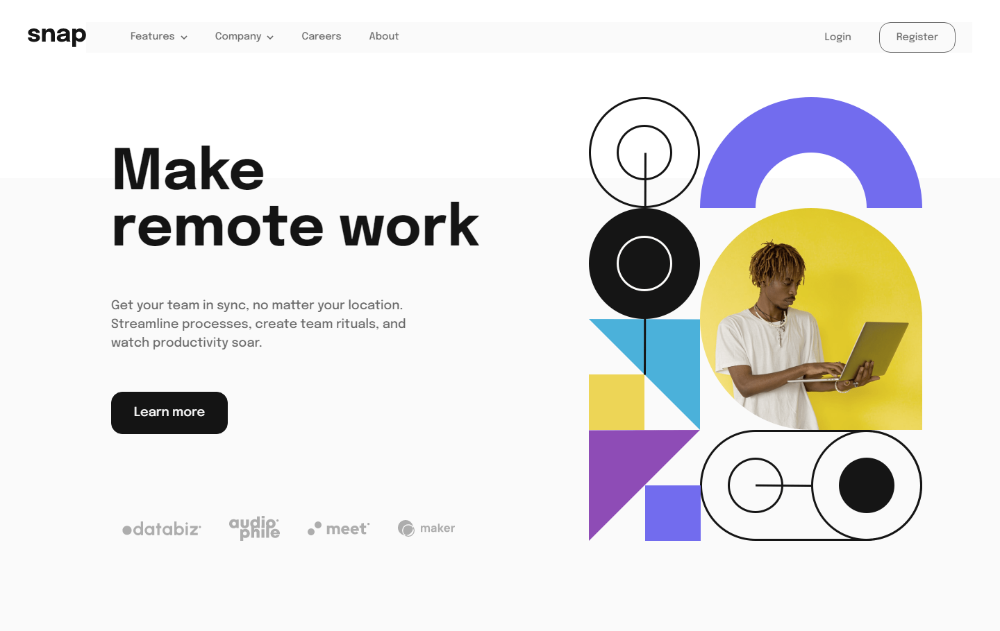

# Frontend Mentor - Intro section with dropdown navigation solution

This is a solution to the [Intro section with dropdown navigation challenge on Frontend Mentor](https://www.frontendmentor.io/challenges/intro-section-with-dropdown-navigation-ryaPetHE5). Frontend Mentor challenges help you improve your coding skills by building realistic projects. 

## Table of contents

- [Overview](#overview)
  - [The challenge](#the-challenge)
  - [Screenshot](#screenshot)
  - [Links](#links)
- [My process](#my-process)
  - [Built with](#built-with)
  - [Continued development](#continued-development)
  - [Useful resources](#useful-resources)
- [Author](#author)

## Overview

### The challenge

Users should be able to:

- View the relevant dropdown menus on desktop and mobile when interacting with the navigation links
- View the optimal layout for the content depending on their device's screen size
- See hover states for all interactive elements on the page

### Screenshot

### Links

- HTML solution URL: [HTML](https://github.com/JustANipple/intro-section-with-dropdown-navigation/blob/master/index.html)
- SCSS solution URL: [SCSS](https://github.com/JustANipple/intro-section-with-dropdown-navigation/blob/master/styles/scss/main.scss)
- JS solution URL: [JS](https://github.com/JustANipple/intro-section-with-dropdown-navigation/blob/master/scripts/script.js)
- Live Site URL: [LIVE](https://justanipple.github.io/intro-section-with-dropdown-navigation/)

## My process

### Built with

- Semantic HTML5 markup
- CSS custom properties
- Flexbox
- CSS Grid
- Mobile-first workflow
- SCSS
- JavaScript

### Continued development

I need to work more on making reusable components. I tried to make some dropdown components to have a standard menu for future challenges, but the code looks a mess

### Useful resources

- [Menu animation](https://codinhood.com/micro/10-dropdown-menu-animations-css-transform) - I used this site to learn how to make a menu animation

## Author

- Frontend Mentor - [@JustANipple](https://www.frontendmentor.io/profile/JustANipple)
